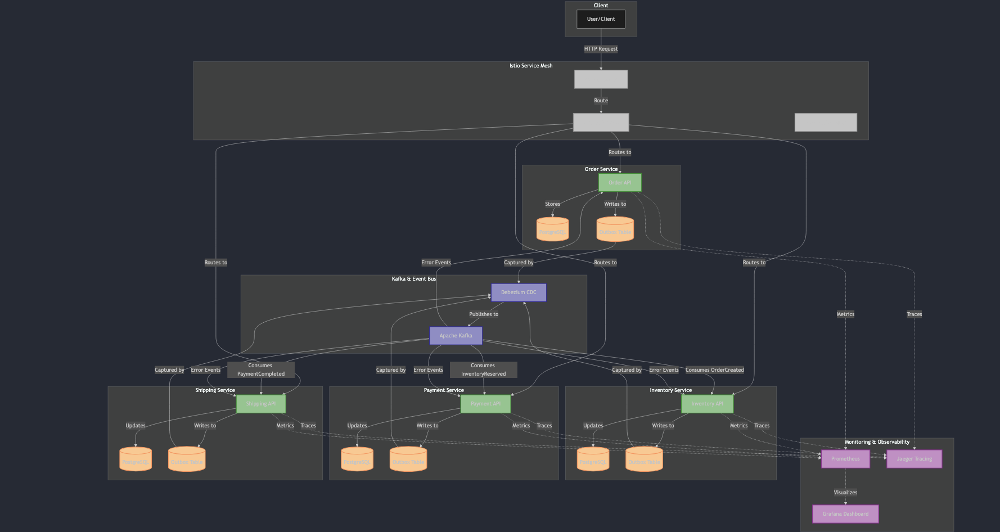

# Saga Transaction Pattern - Distributed Transaction Management

This project demonstrates an implementation of the Saga pattern for managing distributed transactions across microservices using the Outbox pattern with Kafka and Debezium.

## Project Overview

This proof-of-concept (PoC) showcases how to achieve distributed transaction consistency in a microservice architecture, replacing traditional two-phase commit protocols with an event-driven and eventually consistent approach.

### Key Components

- **Microservices**: Order, Inventory, Payment, and Shipping services built with Spring Boot
- **Event-Driven Architecture**: Using Apache Kafka for reliable messaging
- **Outbox Pattern**: Using Debezium CDC to capture database changes and publish events
- **Saga Pattern**: Implementing distributed transactions with compensating actions
- **Observability**: Monitoring with Prometheus, Grafana, and Jaeger
- **Service Mesh**: Network policies and traffic management with Istio
- **CI/CD**: Automated pipelines with Tekton and Argo CD
- **Kubernetes/OpenShift**: Container orchestration with OpenShift-specific resources

## Architecture

The architecture diagram is available as a Mermaid diagram in `docs/images/architecture.md`.



You can also see a simplified ASCII representation of the architecture below:

```
+---------------------------+       +-----------------------------+       +---------------------------+       +---------------------------+
|                           |       |                             |       |                           |       |                           |
|      Order Service        |       |    Inventory Service        |       |     Payment Service       |       |     Shipping Service      |
|                           |       |                             |       |                           |       |                           |
| +---------------------+   |       | +---------------------+     |       | +---------------------+   |       | +---------------------+   |
| |                     |   |       | |                     |     |       | |                     |   |       | |                     |   |
| |   Spring Boot API   |   |       | |   Spring Boot API   |     |       | |   Spring Boot API   |   |       | |   Spring Boot API   |   |
| |                     |   |       | |                     |     |       | |                     |   |       | |                     |   |
| +----------+----------+   |       | +----------+----------+     |       | +----------+----------+   |       | +----------+----------+   |
|            |              |       |            |                |       |            |              |       |            |              |
|            v              |       |            v                |       |            v              |       |            v              |
| +----------+----------+   |       | +----------+----------+     |       | +----------+----------+   |       | +----------+----------+   |
| |                     |   |       | |                     |     |       | |                     |   |       | |                     |   |
| |    PostgreSQL DB    |   |       | |    PostgreSQL DB    |     |       | |    PostgreSQL DB    |   |       | |    PostgreSQL DB    |   |
| |  (Orders + Outbox)  |   |       | | (Inventory + Outbox)|     |       | |  (Payment + Outbox) |   |       | | (Shipping + Outbox) |   |
| |                     |   |       | |                     |     |       | |                     |   |       | |                     |   |
| +----------+----------+   |       | +----------+----------+     |       | +----------+----------+   |       | +----------+----------+   |
|            |              |       |            |                |       |            |              |       |            |              |
+------------|--------------|-------+------------|----------------|-------+------------|--------------|-------+------------|--------------|-------+
             |              |                    |                |                    |              |                    |              |
             v              v                    v                v                    v              v                    v              v
    +------------------------------------------------------------------------------------------------------------------+
    |                                                                                                                  |
    |                                               KAFKA                                                              |
    |                                                                                                                  |
    |  +----------------+    +------------------+    +-------------------+    +------------------+    +--------------+ |
    |  | OrderCreated   |    | InventoryReserved|    | PaymentCompleted  |    | OrderShipped     |    | Error Events | |
    |  +-------+--------+    +--------+---------+    +---------+---------+    +--------+---------+    +-------+------+ |
    |          |                      |                        |                        |                      |        |
    +----------|----------------------|------------------------|-----------------------|----------------------|--------+
               |                      |                        |                        |                      |
               +----> Order Service --+----> Inventory Service-+----> Payment Service --+----> Shipping Service
```

The application follows a microservice architecture where each service has its own database:

1. **Order Service**: Manages customer orders
2. **Inventory Service**: Manages product inventory and stock reservations
3. **Payment Service**: Handles payment processing and refunds
4. **Shipping Service**: Manages shipment of orders

### Saga Flow

The distributed transaction follows a choreography-based saga pattern:

1. Customer creates an order (OrderCreated event)
2. Inventory service reserves stock (InventoryReserved event)
3. Payment service processes payment (PaymentCompleted event)
4. Shipping service prepares shipment (OrderShipped event)
5. Order service completes the order (OrderCompleted event)

If any step fails, compensating transactions are triggered to undo the changes and maintain data consistency.

## Getting Started

### Prerequisites

- Docker and Docker Compose
- Kubernetes cluster or OpenShift 4.x
- Maven

### Local Development

1. Clone the repository:
   ```
   git clone https://github.com/ugurer/Saga-Transactional-Pattern.git
   cd Saga-Transactional-Pattern
   ```

2. Run the services locally using Docker Compose:
   ```
   docker-compose up -d
   ```

3. Deploy the Debezium connectors:
   ```
   curl -X POST -H "Content-Type: application/json" --data @debezium-connectors/order-outbox-connector.json http://localhost:8083/connectors
   curl -X POST -H "Content-Type: application/json" --data @debezium-connectors/inventory-outbox-connector.json http://localhost:8083/connectors
   curl -X POST -H "Content-Type: application/json" --data @debezium-connectors/payment-outbox-connector.json http://localhost:8083/connectors
   curl -X POST -H "Content-Type: application/json" --data @debezium-connectors/shipping-outbox-connector.json http://localhost:8083/connectors
   ```

### Kubernetes/OpenShift Deployment

1. Ensure your Kubernetes/OpenShift context is set to the right cluster.

2. Create the project/namespace:
   ```
   kubectl apply -f kubernetes/openshift/project.yaml
   ```

3. Deploy the infrastructure components:
   ```
   kubectl apply -f kubernetes/kafka/
   kubectl apply -f kubernetes/zookeeper/
   kubectl apply -f kubernetes/postgres/
   ```

4. Deploy the application microservices:
   ```
   kubectl apply -f kubernetes/order/
   kubectl apply -f kubernetes/inventory/
   kubectl apply -f kubernetes/payment/
   kubectl apply -f kubernetes/shipping/
   ```

5. Deploy Debezium:
   ```
   kubectl apply -f kubernetes/debezium/
   ```

6. Deploy the monitoring stack:
   ```
   kubectl apply -f kubernetes/monitoring/
   ```

## Testing the Saga Pattern

The application includes test scenarios for both successful transaction flows and error cases with compensating transactions:

1. **Successful Flow**: Order is created, inventory is reserved, payment is processed, and shipping is executed.
2. **Payment Failure**: Order is created, inventory is reserved, but payment fails, causing the inventory reservation to be released and the order to be canceled.
3. **Shipping Failure**: Order is created, inventory is reserved, payment is processed, but shipping fails, causing the payment to be refunded, inventory to be released, and the order to be canceled.

## CI/CD Pipeline

The project includes Tekton Pipelines for CI and Argo CD for CD:

1. Build and test services with Tekton.
2. Build container images and push to registry.
3. Update deployment manifests and sync with ArgoCD.

## Monitoring and Observability

The PoC includes:

- **Prometheus**: For collecting metrics from services
- **Grafana**: For visualizing metrics and dashboards
- **Jaeger**: For distributed tracing of saga transactions

## Security Considerations

- TLS for Kafka communications
- Network policies to restrict service communication
- RBAC for appropriate service permissions
- SecurityContextConstraints for OpenShift

## Project Structure

```
.
├── debezium-connectors/     # Debezium connector configurations
├── docker-compose.yml       # Local development environment
├── init-scripts/            # Database initialization scripts
├── kubernetes/              # Kubernetes/OpenShift manifests
│   ├── ci-cd/               # CI/CD configurations
│   ├── debezium/            # Debezium deployment
│   ├── istio/               # Service mesh configurations
│   ├── kafka/               # Kafka cluster deployment
│   ├── monitoring/          # Prometheus, Grafana, Jaeger
│   ├── openshift/           # OpenShift-specific resources
│   ├── postgres/            # Database deployments
│   ├── security/            # Security configurations
│   └── zookeeper/           # Zookeeper deployment
└── saga-demo/               # Microservice applications
    ├── order-service/       # Order management service
    ├── inventory-service/   # Inventory management service
    ├── payment-service/     # Payment processing service
    └── shipping-service/    # Shipping management service
```

## Contributing

Contributions are welcome! Please feel free to submit a Pull Request.

## License

This project is licensed under the MIT License - see the LICENSE file for details.

## Acknowledgments

- Chris Richardson's [Microservices.io](https://microservices.io/) for the Saga and Outbox patterns
- Debezium for the CDC capabilities
- Gunnar Morling for his work on the Outbox pattern 