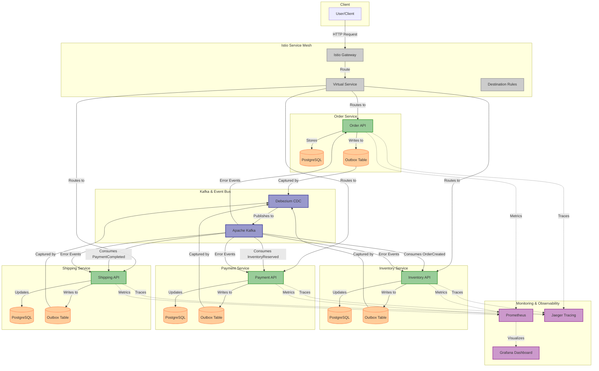

## How to Convert This to PNG

To convert this Mermaid diagram to a PNG image:

1. **Option 1: Using Mermaid Live Editor**
   - Go to [Mermaid Live Editor](https://mermaid.live/)
   - Paste the diagram code
   - Click "Download PNG" to save the image

2. **Option 2: Using VS Code Extension**
   - Install the "Markdown Preview Mermaid Support" extension in VS Code
   - Open this file, and use the Markdown preview
   - Right-click on the diagram and select "Save image as..."

3. **Option 3: Using mermaid-cli**
   - Install mermaid-cli with npm: `npm install -g @mermaid-js/mermaid-cli`
   - Run: `mmdc -i architecture.md -o architecture.png`

Once you have the PNG file, replace the placeholder in docs/images/architecture.png with the actual image. 